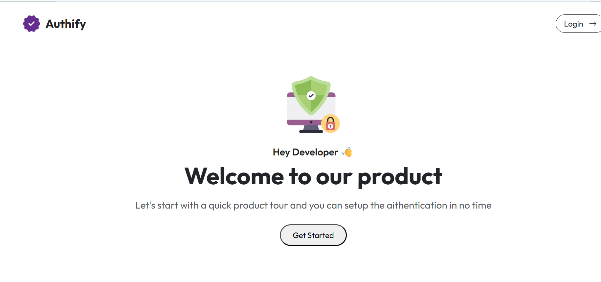
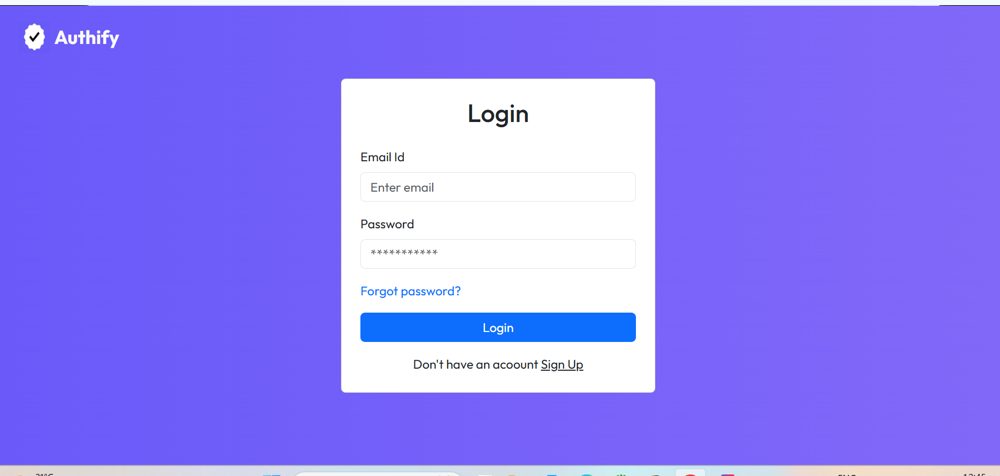
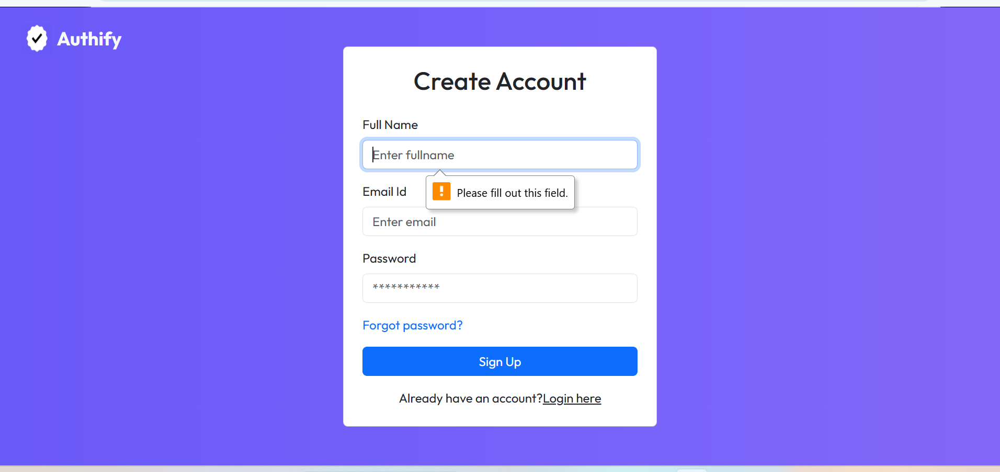
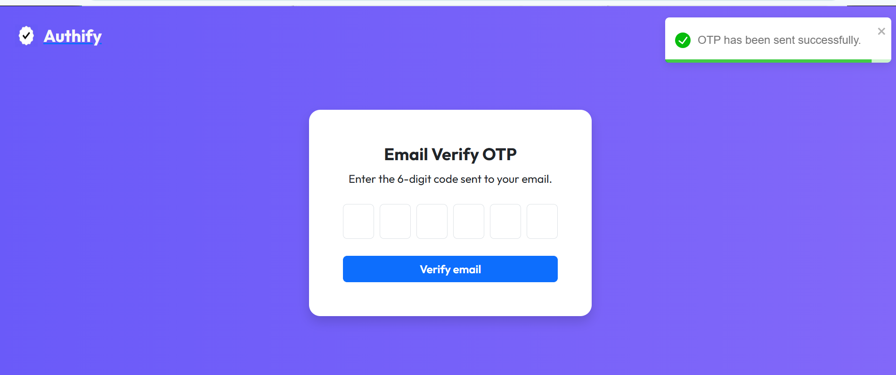

# Authify — Frontend


> A clean, responsive authentication frontend built with React + Vite. Part of the full-stack **Authify** project.

🔗 **Live:** [authify-olive.vercel.app](https://authify-olive.vercel.app)  
🔗 **Backend Repo:** [Authify-Backend](https://github.com/Gopi-Boyi/Authify-Backend)

---

## Screenshots

### Home Page

> Landing page shown to unauthenticated users with a call-to-action to get started.

### Login Page

> Clean login form with email and password. Toggle between Login and Sign Up.

### Register Page

> Registration form with full name, email, and password with client-side validation.

### Email Verify OTP

> 6-digit OTP input for email verification sent to the user's inbox.

---

## Features

- User registration with form validation
- Login / logout with JWT cookie-based auth
- Email verification via 6-digit OTP
- Password reset via OTP sent to email
- Protected routes — redirect unauthenticated users
- Personalized home page showing user's name after login
- Toast notifications for all user actions
- Responsive design with Bootstrap

---

## Tech Stack

| Technology | Purpose |
|---|---|
| React 18 | UI framework |
| Vite | Build tool with HMR |
| React Router DOM | Client-side routing |
| Axios | HTTP client with cookie support |
| Bootstrap 5 | UI components and responsive layout |
| React Toastify | Success/error notifications |
| Context API | Global auth state management |

---

## Project Structure

```
src/
├── assets/
│   └── assets.js           # Image imports
├── Components/
│   ├── Header.jsx           # Top nav with login button
│   └── Menubar.jsx          # Authenticated nav with Verify Email + Logout
├── Context/
│   └── AppContext.jsx       # Global state: auth status, user data, backend URL
├── Pages/
│   ├── Home.jsx             # Landing page / dashboard after login
│   ├── Login.jsx            # Login + Register (toggled)
│   ├── EmailVerify.jsx      # OTP email verification page
│   └── ResetPassword.jsx    # Forgot password flow
└── Util/
    └── Constants.js         # Backend API base URL
```

---

## Auth Flow

```
User visits site
      ↓
AppContext checks /is-authenticated
      ↓
Not logged in → Show Login button
      ↓
User registers → Welcome email sent → Redirect to Home
      ↓
User logs in → JWT stored in HttpOnly cookie
      ↓
Authenticated → Show personalized home + Menubar
      ↓
User verifies email → OTP sent → Account verified
```

---

## Getting Started

### Prerequisites
- Node.js 18+
- Backend running locally on port 8080

### Installation

```bash
git clone https://github.com/Gopi-Boyi/Authify
cd Authify
npm install
```

### Environment Setup

Create a `.env` file in the root:

```env
VITE_API_URL=http://localhost:8080/api/v1.0
```

### Run Locally

```bash
npm run dev
```

Open [http://localhost:5173](http://localhost:5173)

### Build for Production

```bash
npm run build
```

---

## Deployment

Deployed on **Vercel** with auto-deploy on push to `main` branch.

**Vercel Environment Variables:**
```
VITE_API_URL=https://authify-backend-production-50ef.up.railway.app/api/v1.0
```

---

## Related

- [Authify Backend](https://github.com/Gopi-Boyi/Authify-Backend) — Spring Boot REST API

---

## Author

**Gopi Boyi** — Java Full Stack Developer  
GitHub: [@Gopi-Boyi](https://github.com/Gopi-Boyi)
